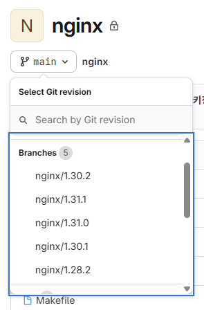
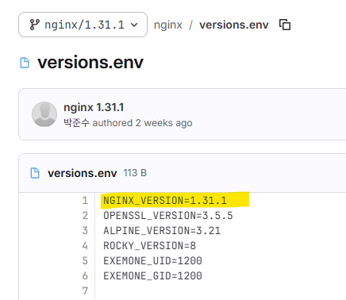

# 버젼 확인 페이지
- https://nginx.org/en/download.html
  id:: 6a3a1f14-a16f-4b2d-9a85-a477fa1555d3
-
- nginx 최신 패치 요구가 계속 있음
-
- # 레포지토리
- https://gitlab.exem.xyz/exemone/middleware/nginx
-
- # 버젼 변경 방법
- #### 1. 새로운 버젼 브랜치 생성
- 
-
- #### 2. versions.env 수정
- 
-
- #### 3. exemone-package 수정
- 바이너리 반영 위해 수정 필요
- ((6a3a1f14-a16f-4b2d-9a85-a477fa1555d3)) 바이너리 다운로드 후
- ``exemone-package/package/binary/bins/nginx`` 디렉토리의 `nginx` 실행 파일 변경